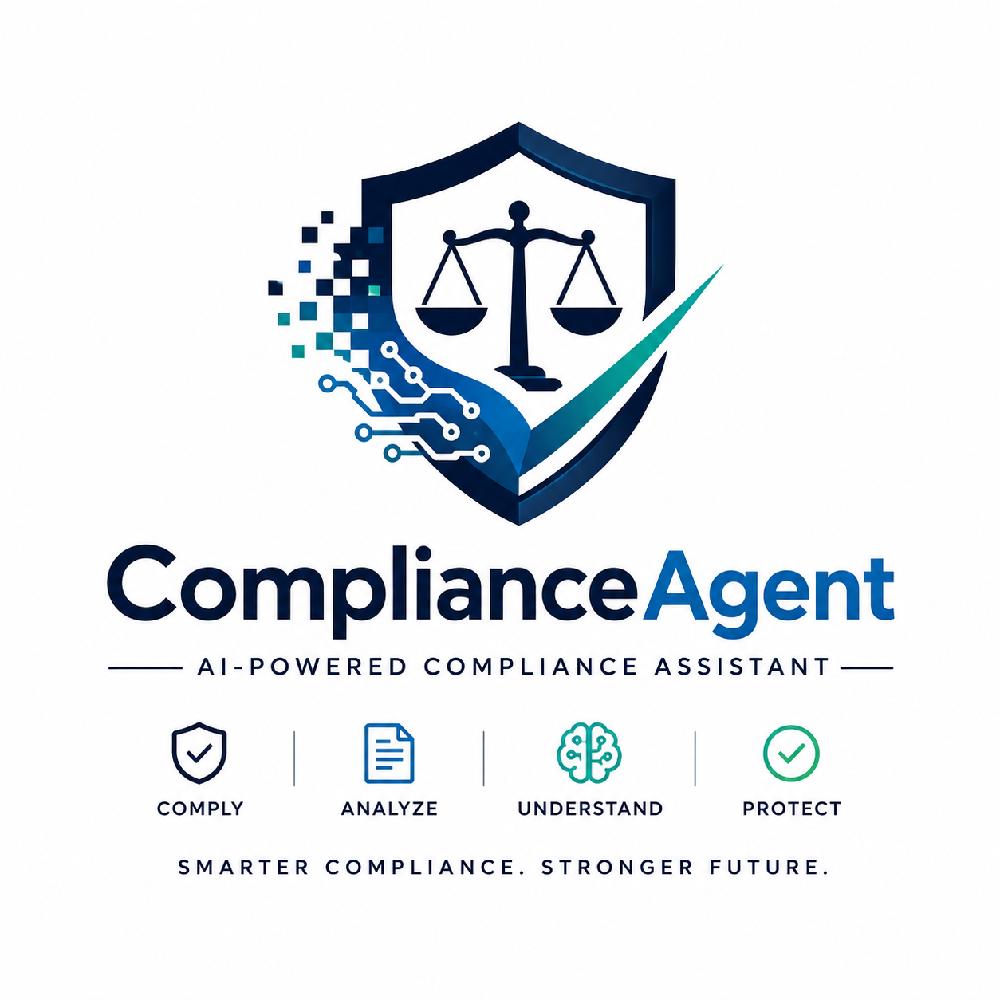

<p align="center">
  
</p>

# 🚀 Legal Compliance AI Agent

> Agentic AI | RAG | Memory | Guardrails | Groq LLM

---

## 📌 Project Overview

Legal Compliance AI Agent is an enterprise AI-powered web application developed as part of the IIT Mandi AI Program Mini Project.

The application enables organizations to upload compliance documents and ask questions using natural language.

The AI retrieves relevant information from uploaded documents, remembers previous conversations, and provides accurate responses with source citations.

---

## ✨ Features

- Google Sign-In (OAuth 2.0, no passwords stored)
- AI Powered Compliance Assistant
- PDF Upload
- Retrieval Augmented Generation (RAG)
- Conversation Memory
- Guardrails
- Source Citations
- Groq LLM Integration
- Streamlit Web Interface

---

## 🏗 Architecture

```
User
   │
   ▼
Streamlit UI
   │
   ▼
Guardrails
   │
   ▼
Memory
   │
   ▼
Retriever
   │
   ▼
FAISS Vector Database
   │
   ▼
Groq LLM
   │
   ▼
Response
```

---

## ⚙ Tech Stack

| Layer | Technology |
|--------|------------|
| Frontend | Streamlit |
| Backend | Python |
| AI Framework | LangChain |
| LLM | Groq |
| Vector Database | FAISS |
| Embeddings | Sentence Transformers |

---

## 🚀 Installation

Clone Repository

```bash
git clone https://github.com/ankur-gaurav161418/ComplianceAgent-.git
```

Open Folder

```bash
cd ComplianceAgent-
```

Create Virtual Environment

```bash
python -m venv venv
```

Activate

```bash
venv\Scripts\activate
```

Install Packages

```bash
pip install -r requirements.txt
```

Run

```bash
python create_vector_db.py
```

```bash
streamlit run app.py
```

---

## 🔐 Authentication

Access is gated behind **Sign in with Google** — there is no password-based login. Set up your own
OAuth credentials once per environment:

1. Go to [Google Cloud Console](https://console.cloud.google.com/) → create (or select) a project.
2. **APIs & Services → OAuth consent screen** — set User type to *External*, fill in the app name,
   support email, and add your own Google account under **Test users** (unless you verify the app).
3. **APIs & Services → Credentials → Create Credentials → OAuth client ID**
   - Application type: **Web application**
   - Authorized redirect URI: `http://localhost:8501/oauth2callback`
     (add your production URL's `/oauth2callback` too if you deploy elsewhere)
4. Copy the generated **Client ID** and **Client Secret**.
5. Create `.streamlit/secrets.toml` in the project root (this file is gitignored — never commit it):

   ```toml
   [auth]
   redirect_uri = "http://localhost:8501/oauth2callback"
   cookie_secret = "a-long-random-string"   # e.g. python -c "import secrets; print(secrets.token_hex(32))"

   [auth.google]
   client_id = "YOUR_GOOGLE_CLIENT_ID.apps.googleusercontent.com"
   client_secret = "YOUR_GOOGLE_CLIENT_SECRET"
   server_metadata_url = "https://accounts.google.com/.well-known/openid-configuration"
   ```

6. Run the app — you'll land on a "Continue with Google" screen before the chat UI is reachable.

---

## 📂 Project Structure

```text
ComplianceAgent
│
├── app.py
├── create_vector_db.py
├── requirements.txt
├── README.md
├── assets
├── data
├── utils
└── screenshots
```

---

## 🔮 Future Scope

- Multi-Agent AI
- Contract Analyzer
- Risk Assessment
- Compliance Auditor
- Cross-border Compliance Advisor

---

## 👨‍💻 Author

Ankur Gaurav

IIT Mandi AI Program
